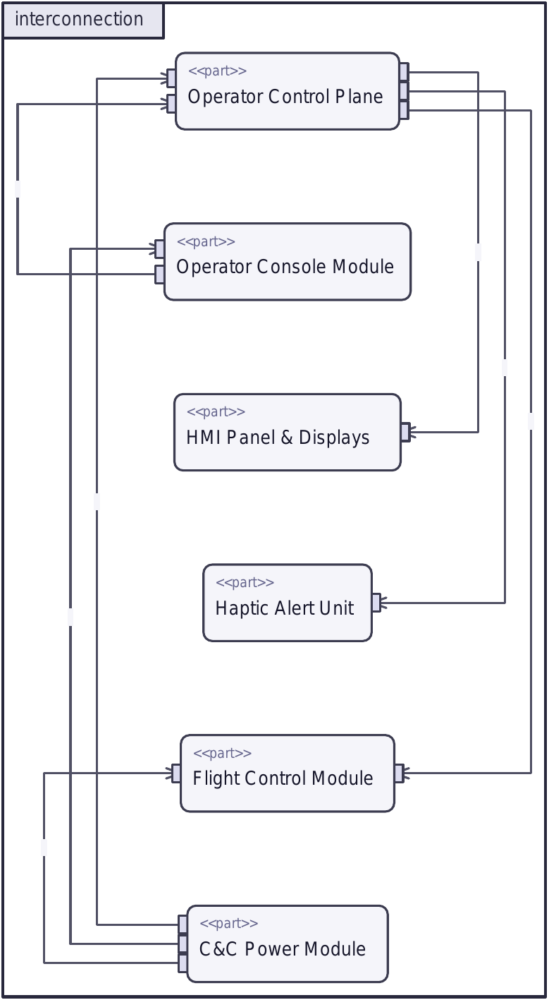
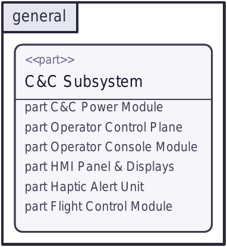
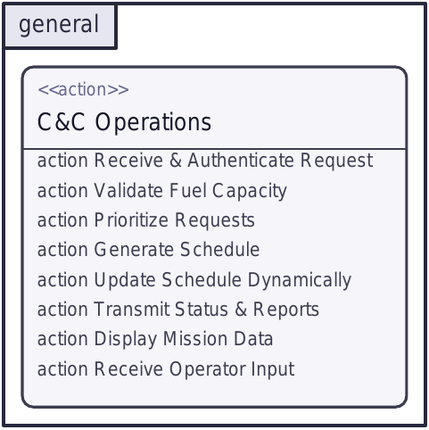
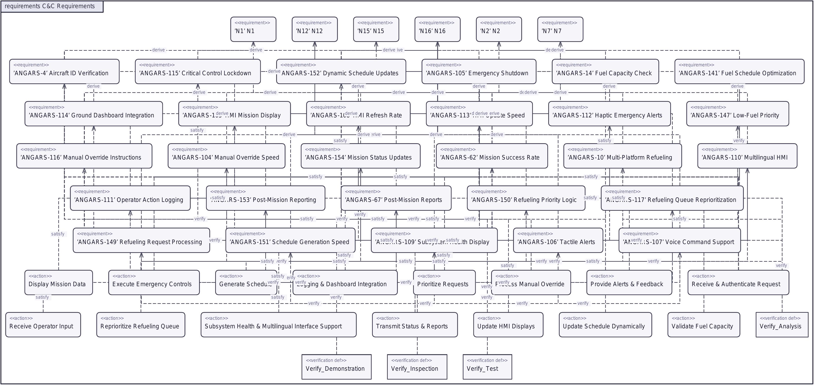
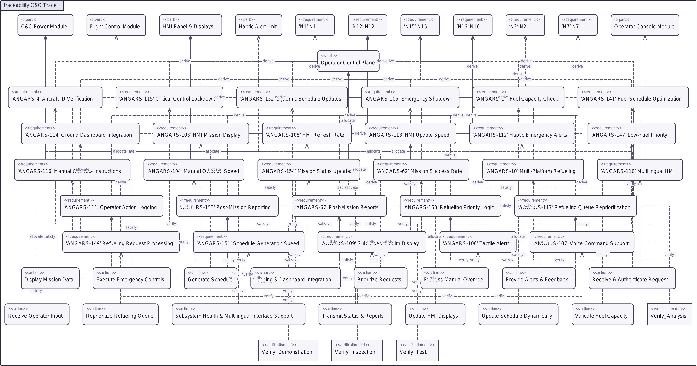

# sysml-bridge

**Corpus-grounded SysML v2 authoring with Claude — every element cited, every gate enforced.**

<a href="https://github.com/joescohen/sysml-bridge/actions/workflows/ci.yml"></a>

sysml-bridge turns an engineering corpus — requirement spreadsheets, interface (N2) matrices,
specification PDFs — into a validated SysML v2 model, and renders it as Cameo-style diagrams. The
whole Tier-1 pipeline is deterministic and runs with no API key: `pnpm demo` goes corpus →
extract → build → audit → grammar-validate → render on the committed ANGARS corpus.



## The trust story

**Corpus-grounded.** Every model element carries a `provenanceSourceId` pointing back to the
corpus row it came from — a requirement in a spreadsheet, an interface flow in an N2 matrix, a
line in a spec. This is the anti-fabrication contract: it was born from a real failure on
2026-06-09, when a hand-authored model quietly invented subsystems that were nowhere in the
source. Nothing enters the model uncited. The Interconnection diagram above is the contract made
visible — each of its connection edges traces to a specific N2 spreadsheet cell (workbook, sheet,
row, cell).

**Gate-validated.** Generated models pass three gates, in order, and the pipeline stops on the
first failure:

1. **Gate 1 — model audit.** Provenance, relational, and fidelity checks over the built model
   (`packages/gates`). A findings list that isn't empty stops the build.
2. **Gate 2 — grammar validator.** The emitted `.sysml` is parsed by a committed ANTLR grammar
   validator (`tools/sysml-validator`). A non-zero exit means the file will not import — no claim
   that it does is permitted without a clean run on the exact file.
3. **Gate 3 — Cameo import.** The manual semantic epilogue: paste the validated `.sysml` into
   Cameo Enterprise Architecture's Textual Editor and synchronize. The grammar validator checks
   syntax; Cameo is the binding semantic gate. Screenshots are the evidence — this step is not
   automated.

Each gate can fail, and each has been proven to fail against a known-bad input — a gate never
shown to fail is not a gate you can trust.

**Human-gated LLM layers.** The LLM-assisted layers — prose ingest and inference — *propose,
never write*. Candidates arrive with citations and require an explicit human approval, made through
`/mbse-approve`, before they can enter the model. No code path writes an approval; a source-scanning
ratchet test fails if one ever does. See [Tier 2](#tier-2-human-gated-llm-layers) below. Tier-1
stays fully deterministic and needs no API key.

## Gallery

Rendered by the DeciSym viewer fork directly from the validated `.sysml`, exported headless to
PDF and PNG. All five are regenerated by `pnpm demo` on every run.

### Interconnection (IBD)


The C&C subsystem's six `<<part>>` blocks — Operator Control Plane, Operator Console Module, HMI
Panel & Displays, Haptic Alert Unit, Flight Control Module, C&C Power Module — wired by their
interconnections. Every connection edge comes from a row in the ANGARS N2 interface data, and
each carries provenance back to the exact spreadsheet cell it was read from.

### General / subsystem (BDD)



The C&C Subsystem definition with its six part properties — the block-definition view of the same
decomposition shown structurally in the IBD.

### General / operations (activity)



The C&C Operations action, decomposed into 15 corpus-grounded sub-actions (the F1.x scheduling
and F8.x operator-interaction functions); the compartment view shows the first eight, from
*Receive & Authenticate Request* to *Receive Operator Input*.

### Requirements



The `C&C Requirements` context: all 34 `<<requirement>>` usages — 6 stakeholder needs across the
top rank, the 28 system requirements below — laid out as a derive tree, each system requirement's
`«deriveReqt»` dependency pointing up to the stakeholder need it decomposes, with `satisfy` and
`verify` edges dropping to the realizing actions and verification cases. At ANGARS scale each
rank wraps into multiple sub-rows once it would exceed the canvas-width cap, so the diagram reads
as a compact block (≈3590×1699 px) rather than a single unreadable horizontal ribbon. Every
requirement and every edge traces back to a row in the ANGARS corpus.

### Traceability



The `C&C Trace` context: the cross-pillar web joining all four pillars — stakeholder needs,
requirements, functions, and components — through 100 trace edges (`derive` / `satisfy` /
`allocate` / `verify`), layered top-down by rank, with each over-wide rank wrapped into
sub-rows so the web stays legible at README size (≈3590×1885 px) instead of stretching into a
16 000-px strip. Every edge is corpus-grounded: no relationship appears here that isn't backed
by a cell in the ANGARS interface, satisfy, or verification data.

## Fidelity

The build re-derives the requirement-to-satisfaction trace and compares it to the reference C&C
model:

**28/28 trace pairs (100%)** verified against the reference model, re-checked in CI on every push.

The baseline is a committed constant (`examples/angars/fidelity-baseline.json`), read by CI —
never hardcoded in the workflow. A drop below 100% is a failure to investigate, not a number to
lower. Alongside it, 714 unit tests (134 model + 154 sysml + 94 gates + 203 candidates + 124
mcp-server + 5 review-ui) run in CI, and the grammar validator ships with committed positive controls that
prove it rejects bad syntax.

## Quick start

```bash
git clone https://github.com/joescohen/sysml-bridge.git
cd sysml-bridge
pnpm install
python3 -m venv .venv && .venv/bin/pip install -r tools/sysml-validator/requirements.txt
pnpm demo
```

`pnpm demo` runs the full Tier-1 pipeline — extract → build → Gate 1 → Gate 2 → render — and
writes outputs to `examples/angars/out/`. It is deterministic and needs no `ANTHROPIC_API_KEY`.

**Prerequisites:** Node 20+ and pnpm; Python 3 for the grammar validator (the venv above is a hard
requirement — a missing validator venv fails the demo rather than skipping the gate); Rust
toolchain 1.96 for the viewer (the render step builds it). `pdftoppm` (poppler-utils) is optional
and only needed to rasterize the PDF renders into PNGs.

## Demo tiers

The repo is organized around four reviewer experiences, in increasing effort:

| Tier | Experience | Requires | Status |
|---|---|---|---|
| 0 — browse | This README as a gallery: rendered views, fidelity numbers, the trust story | nothing | ships now |
| 1 — run | `pnpm demo`: corpus → extract → build → Gate 1 → grammar validate → render, deterministic | Node + pnpm + Python | ships now |
| 2 — gates | Human-gated LLM layers: prose candidates with citations, propose/approve, seeded-defect run showing fabrication caught | ANTHROPIC_API_KEY (demo needs none) | ships now |
| 3 — drive | `/mbse` orchestrator live in Claude Code — the interview prop | Claude Code | ships now |

### Tier 2 — human-gated LLM layers

Two LLM-assisted layers can add to the model: prose ingest reads specification PDFs for candidate
requirements, and inference proposes trace relationships. Both *propose, never write*. Each
candidate arrives with a citation, and it enters the model only through an explicit human approval
recorded by `/mbse-approve` — the code has no path that writes an approval, and a source-scanning
ratchet test fails if one is ever added. This is the anti-fabrication contract of the trust story
carried into the LLM tier: the four rules behind it are written up in
[docs/gate-pattern.md](docs/gate-pattern.md).

The visible proof is the seeded-defect harness. `pnpm demo:seeded` plants three known defects with
fixed ids into a copy of the clean ANGARS build and shows each gate catch its own — a missing
provenance finding, a non-zero grammar-validator exit on a poisoned file, and an R4 def-operand
finding — alongside a clean control that must report zero errors. It runs in CI and needs no API
key. `ANTHROPIC_API_KEY` is required only for *live* candidate generation from a corpus; the demo
and the harness are deterministic without it.

#### Gap-driven weave passes

Once the model has a shape, the weaver closes completeness gaps in bounded passes. `pnpm weave`
runs one pass over a project and then *stops for the human* — it proposes, it never approves:

```bash
pnpm weave --project <dir>              # open a pass: audit → queue → propose → STOP
# ...review + approve the proposals in the review UI...
pnpm weave --project <dir> --close-pass # recompose → re-audit → record + convergence gate
```

A pass is **audit → queue → propose → (human reviews) → recompose → re-audit → record**:

1. `audit()` runs on the composed model. Each completeness finding is mapped to a targeted
   retrieval query by an explicit, unit-tested table: `GATE02-unsatisfied` → a satisfy-family
   query from the requirement's name+text; `GATE02-orphan` → an allocation-family query for the
   element; `GATE02-uncovered-need` → a derive-family query. A finding with no query strategy is
   **reported, never silently skipped**.
2. A **bounded** targeted inference pass runs over only those queries (the budget cap and the
   per-query entity scope are logged — no silent caps). It enumerates cross-document candidates
   over the entity store and attributes each queued candidate back to the gap element it targets.
3. Proposals land in the **normal review queue** (`<dir>/candidates/inference-candidates.json`).
   The pass then stops. **`weave` writes no disposition** — approving a proposal is a human act in
   the review UI, and a source-scan test fails if any weave code path ever calls an approval
   writer.
4. `--close-pass` recomposes the model with whatever was approved, re-audits, and writes
   `<dir>/passes/pass-NNN.json` (`sysml-foundry/pass-record@1`) with six fields: `auditBefore`,
   `queries`, `candidatesProposed`, `dispositionsApplied`, `auditAfter`, `warningsDelta`.
5. **Convergence is a hard gate.** A closed pass must end with zero error-severity findings and may
   never end with more errors than it began — either violation is a non-zero exit. The
   completeness-*warning* delta per rule id is the soft signal: reported in the record, not gated,
   because a legitimately growing model creates new orphans and the record makes that trend
   inspectable instead of pretending monotonicity.

With no provider key the pass uses a deterministic mock provider, so the loop — and its
convergence gate — runs end-to-end in CI without a key; a key is needed only for model-authored
proposals. Set `OPENROUTER_API_KEY` to use GLM via OpenRouter (model from `OPENROUTER_MODEL`,
default `z-ai/glm-5.2`), or `ANTHROPIC_API_KEY` for Claude; OpenRouter takes precedence when both
are set.

#### Review UI

```bash
pnpm review
```

serves a local page for working the gate: the ANGARS candidate queue (319 prose candidates with
their citations, 133 inference proposals with premises and confidence) with a detail pane and
explicit approve/reject buttons. It writes the same disposition records as `/mbse-approve` —
literally the same writer functions, and an equivalence test proves an approval made in the UI
composes identically to one made through the skill (the content-addressed entry ids match). The
source-scanning ratchet covers the UI's write surface too: any new code path that writes an
approval fails the suite until reviewed.

## Layout

```
sysml-bridge/
├── packages/
│   ├── model/            # element/relationship types, FileStore, IR schema + composeIR
│   ├── sysml/            # model ↔ SysML v2 textual notation: serializer, parser, validator glue
│   ├── gates/            # Gate 1 audits: provenance, relational, fidelity
│   ├── candidates/       # human-gated LLM layers: prose ingest + inference (propose, never write)
│   ├── mcp-server/       # 11 MCP tools over the model store + lifecycle session tracker
│   ├── review-ui/        # local web page for the human gate (same writers as /mbse-approve)
│   └── skills/           # /mbse orchestrator + verb skills (drift-checked against the tools)
├── tools/
│   ├── sysml-validator/  # committed ANTLR grammar validator (Gate 2) + positive controls
│   └── viewer/           # DeciSym fork — reads .sysml, exports headless PDF/PNG
├── examples/angars/      # committed corpus, extracted IR, pipeline scripts, generated out/
├── docs/
│   ├── sysml-v2-reference/  # vendored SysML v2 grammar (.g4, MIT) + cheatsheet
│   └── gallery/             # committed render copies referenced by this README
└── .github/workflows/ci.yml
```

## License

MIT — see [LICENSE](LICENSE).
