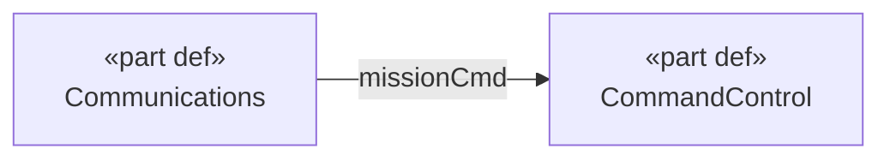

> **Grounding rules:** read `packages/skills/skills/_shared/knowledge-preamble.md` before this skill.

# MBSE Diagram

Render model structure as Mermaid text diagrams sourced from the file-native MCP model store.
All visual output is Mermaid text generated from `query_elements` and `query_relationships`
results. (Diagram-creation tools belong to the HTTP-only server and are not available here.)

## Diagram Types

| Type      | Mermaid format      | What it shows                          |
|-----------|---------------------|----------------------------------------|
| `bdd`     | classDiagram        | Part definitions, compositions         |
| `ibd`     | flowchart           | Ports, connections, flows              |
| `state`   | stateDiagram-v2     | States, transitions, triggers          |
| `context` | flowchart           | System boundary, actors, interfaces    |
| `trace`   | flowchart           | Requirements → blocks → verification   |

## Workflow

1. **Query model state** — `query_elements` and `query_relationships` to understand what exists.
2. **Choose diagram type** — pick the Mermaid format from the table above.
3. **Generate Mermaid** — build from query results inline and return the fenced code block
   to the user.

## Building diagrams from relationships

There is no `get_traceability` tool. Source diagram data from:

- `query_relationships(type_filter: "ConnectionUsage")` → IBD edges with `connectorEnd` data
- `query_relationships(type_filter: "SatisfyRequirementUsage")` → traceability links
- `query_relationships(type_filter: "AllocationUsage")` → allocation links
- `query_relationships(element_id: id)` → all relationships touching a specific element

## Mermaid example — IBD context

Build by querying `ConnectionUsage` elements and resolving their `connectorEnd[].connectedFeature`
IDs to port names, then to their owning PartDefinitions.

## Tools Used

- `query_elements`
- `query_relationships`
- `get_project_state`
