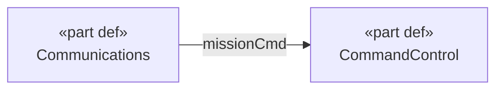

# MBSE Diagram

Render model structure as visual diagrams — either as SysON representations (embedded in the
dashboard iframe) or as Mermaid text (for documentation).

## Diagram Types

| Type      | SysON diagram type          | Mermaid format      | What it shows                          |
|-----------|-----------------------------|---------------------|----------------------------------------|
| `bdd`     | General View                | classDiagram        | Part definitions, compositions         |
| `ibd`     | Interconnection View        | flowchart           | Ports, connections, flows              |
| `state`   | State Transition View       | stateDiagram-v2     | States, transitions, triggers          |
| `req`     | Requirements Table View     | —                   | Requirement hierarchy and attributes   |
| `context` | —                           | flowchart           | System boundary, actors, interfaces    |
| `trace`   | —                           | flowchart           | Requirements → blocks → verification   |

## Workflow

1. **Query model state** — `query_elements` and `query_relationships` to understand what exists.
2. **Choose output format**:
   - SysON representation (previewable in dashboard) → `create_diagram`
   - Mermaid text (documentation, export) → generate inline from query results
3. **Create SysON diagrams** — `create_diagram(elementId, diagramType, name)`:
   - `"General View"` — BDD equivalent (PartDefinitions and structure)
   - `"Interconnection View"` — IBD (ports and connections)
   - `"State Transition View"` — state machine
   - `"Requirements Table View"` — requirements table
4. **Generate Mermaid** — for context diagrams, traceability views, or stakeholder docs,
   build from `query_elements` + `query_relationships` results.

## Building diagrams from relationships

There is no `get_traceability` tool. Source diagram data from:

- `query_relationships(type_filter: "ConnectionUsage")` → IBD edges with `connectorEnd` data
- `query_relationships(type_filter: "SatisfyRequirementUsage")` → traceability links
- `query_relationships(type_filter: "AllocationUsage")` → allocation links
- `query_relationships(element_id: id)` → all relationships touching a specific element

## Mermaid example — IBD context

Build by querying `ConnectionUsage` elements and resolving their `connectorEnd[].connectedFeature`
IDs to port names, then to their owning PartDefinitions.

## Tools Used

- `query_elements`
- `query_relationships`
- `create_diagram`
- `get_project_state`
